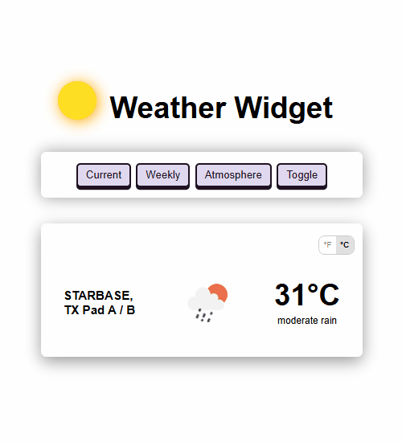
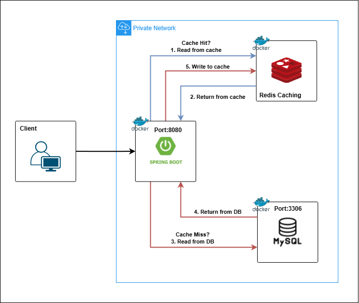

## Weather Widget

A reusable weather widget component designed for seamless integration across multiple projects.
It leverages Spring Boot with WebClient to fetch data from the OpenWeather API and uses Redis caching for optimized performance.
The React frontend ensures a smooth, responsive, and modern user experience.

<div align="center">
  
</div>

---

## Redis Caching

<div align="center">
  
</div>

- **1, 2:** The application first checks Redis. If the requested data is available, it is retrieved directly from the cache, avoiding a database query.

- **3, 4, 5:** If the data is not found in Redis, the application queries the database. Once the data is retrieved, it is stored in the cache for faster access in future requests.

---

## How to run the project

### 1. Backend

1. Make sure you have **Docker** installed on your system.
 ```bash
  docker --version
 ```
2. Create the environment variables according to **env.example** file.
3. Make sure the project profile is set to the **production profile**.
4. Open a terminal in the project directory and run the following command to build and start the application:

```bash
  docker-compose up --build -d
 ```

### 2. Frontend

1. Make sure you have Node.js version 16 or higher installed for compatibility with Vite and React dependencies.
    ```bash 
    node -v
   ```
3. Install the dependencies:
   ```bash 
    npm install
   ```
4. Start the development server:
   ```bash 
    npm run dev
   ```